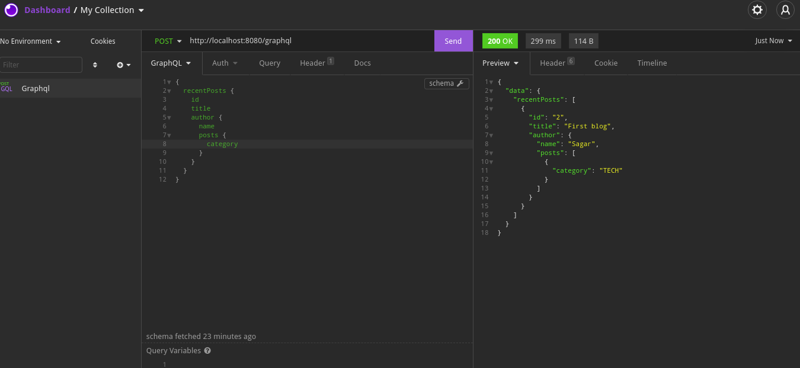

# Guide

https://www.baeldung.com/spring-graphql

## Start docker container

```bash
docker run --rm --name pg-docker -e POSTGRES_PASSWORD=docker -d -p 5432:5432 -v $HOME/docker/volumes/postgres:/var/lib/postgresql/data postgres:11.0
```

Run the application, it will load some dummy data.

## For testing
Use GraphiQL https://www.electronjs.org/apps/graphiql
or https://insomnia.rest/download


