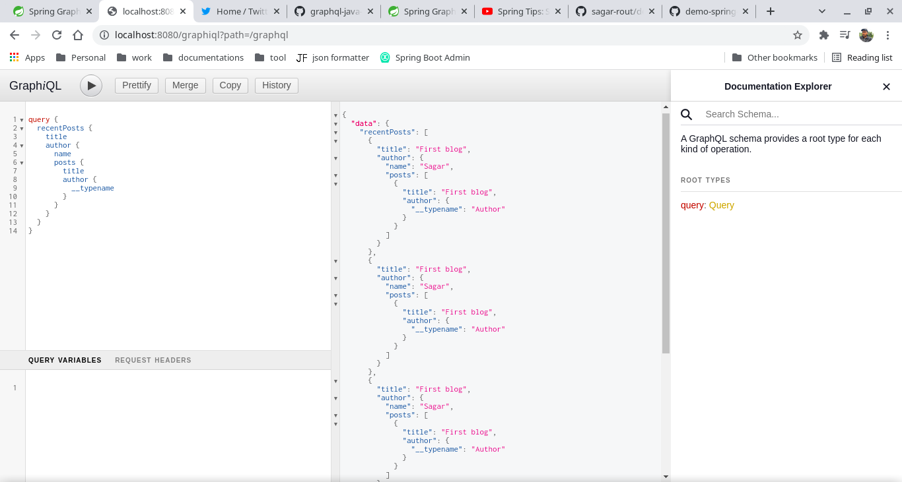

# Guide

> https://docs.spring.io/spring-graphql/docs/1.0.0-M3/reference/html/

> https://www.youtube.com/watch?v=kVSYVhmvNCI&t=984

## Start docker container

```bash
docker run --rm --name pg-docker -e POSTGRES_PASSWORD=docker -d -p 5432:5432 -v $HOME/docker/volumes/postgres:/var/lib/postgresql/data postgres:11.0
```

Run the application, it will load some dummy data.

## For testing
Use embedded graphiql http://localhost:8080/graphiql?path=/graphql



